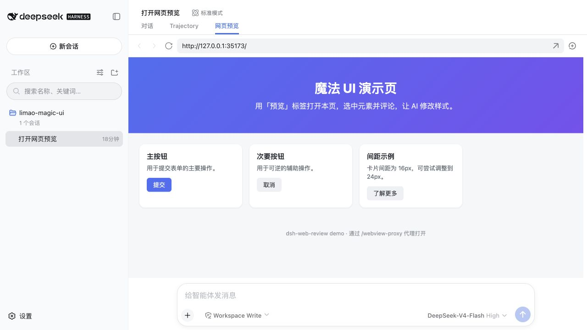
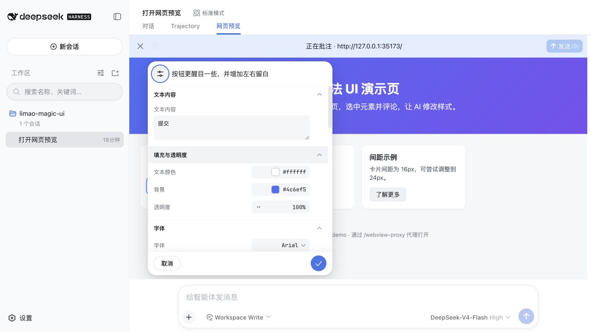

# dsh-web-review

> 为 DeepSeek Harness Web GUI 增加原生的「网页预览 + 元素批注 + AI 改代码」评审闭环。

把正在开发的网页直接放进 DSH 对话：浏览页面、点选任意元素、写下修改意见，或像设计工具一样临时调整文本、颜色、字体、尺寸、间距、边框与效果。发送后，批注会作为独立的结构化上下文交给当前 Agent，由它修改已连接工作区中的前端源码。

<p align="center">
  
  
</p>

## 为什么用它

- **所见即所改**：不用反复描述“右上角第二个按钮”，直接点选页面元素并留下意见。
- **设计与代码同屏闭环**：样式和文本可先在页面中预览，确认后再让 Agent 落到真实源码。
- **不打断对话工作流**：复用 DSH 原生会话标签、输入框和发送流程，不需要额外的模型工具。
- **批注信息更准确**：自动携带选择器、可访问名称、语义类名、框架源码锚点和变更前后值，减少 Agent 猜测。
- **改动可回滚**：页面里的临时预览在取消、清空、移除、发送成功、导航或卸载时恢复原值。

## 功能一览

### 网页预览

- 在会话顶部注册原生「网页预览」标签，支持输入 URL、前进、后退、刷新和外部打开。
- Agent 回复中的绝对 HTTP(S) 链接可直接在预览标签中打开。
- 页面通过 `/webview-proxy` 加载，自动处理相对资源、根路径资源、表单与 SPA fallback。
- 与当前会话、当前工作区绑定；Agent 修改源码后可手动刷新查看结果。

### 元素点选与批注

- 开启批注模式后，悬停高亮页面元素，点击即可打开宿主层编辑器。
- 自动生成最短唯一 CSS 选择器，并捕获标签、文本、ARIA 信息、稳定类名及 React / Vue / Svelte 源码锚点。
- 每条批注在页面中显示编号标记；点击标记或批注列表可重新定位并编辑。
- 输入框上方只保留一个紧凑批注胶囊，可查看同步状态、全部目标与评论。

### Figma 风格属性调整器

- 支持安全的直接文本修改。
- 支持文本色、背景、透明度、字体、字重、字号、行高、字间距、对齐和文本装饰。
- 支持宽高、显示与定位、Margin、Padding、边框、圆角、约束和效果。
- 修改即时预览；每个已变更字段都能单独重置，取消时恢复精确的原始内联值与优先级。

### AI 协作闭环

- 浏览器只发送有界、严格校验的结构化快照，不直接拼接模型提示词。
- 批注准备完成后，在 `agent/pre-step` 阶段追加一条独立的插件来源消息，不改写用户原始输入。
- 有输入草稿时沿用 DSH 原生发送机；没有草稿时发送固定请求“请根据页面批注修改前端实现。”。
- 发送失败时批注保持可见并可重试；确认进入会话后才清空批注和临时页面改动。

## 安装与启动

### 前置条件

- 支持官方 profile 插件机制的 DeepSeek Harness；已验证基线为 `snapshot-20260810T155924Z-8ec407cd64`
- 已安装 `dsh` 与 pnpm

### 使用官方 bundle 安装

下载 Release 中的 `dsh-external-dsh-web-review-<版本>.tgz`，然后通过 DSH 官方的 profile 插件命令安装到 `web` profile：

```sh
dsh plugin --profile web add ./dsh-external-dsh-web-review-0.0.1.tgz
```

安装命令会把插件加入 `web` profile 的依赖，并根据包内 `dsh.bundle.patch` 声明自动启用配置层。可先检查最终配置，再启动 DSH：

```sh
dsh --profile web --dump-config
dsh web
```

更新或卸载同样使用官方命令：

```sh
dsh plugin --profile web add ./dsh-external-dsh-web-review-0.0.2.tgz
dsh plugin --profile web remove @dsh-external/dsh-web-review
```

### 从源码生成官方安装包

如果没有现成的 Release 包，可从源码构建同样的 bundle tarball：

```sh
git clone https://github.com/dsh-external/dsh-web-review.git
cd dsh-web-review
export DSH_HARNESS=/绝对路径/deepseek-harness
pnpm install
pnpm setup:harness
pnpm package:official
```

产物位于 `dist/dsh-external-dsh-web-review-<版本>.tgz`。其中只包含自包含的 Node bundle、使用稳定包名注册的浏览器 bundle、官方 `cordis.patch.yml` 和 README，不包含源码、本机 `node_modules` 或开发用绝对路径配置。

## 使用方法

1. 启动前端开发服务器，复制它的绝对 HTTP(S) URL。
2. 打开 DSH 会话中的「网页预览」，输入 URL 并回车。
3. 点击右上角批注按钮，再点击页面中的目标元素。
4. 写评论；如需视觉调整，展开「调整」并修改属性。
5. 确认批注，等待输入框上方显示“发送时注入”。
6. 直接发送原有需求，或使用批注栏中的计数发送按钮。
7. Agent 修改工作区源码后，刷新预览验收；不满意可继续批注下一轮。

## 工作原理

| 部分 | 职责 |
|---|---|
| Node 端 | 页面代理、批注请求校验、稳定英文上下文组装、会话级待发送状态 |
| 浏览器端 | 预览标签、同源元素选择器、宿主层属性编辑器、批注胶囊与发送确认 |
| AI 协作 | 在进入模型步骤前追加独立插件消息；Agent 使用现有工作区文件和 Shell 工具改源码 |

插件不会注册新的模型工具，也不会把截图、完整 `outerHTML`、全量计算样式或编辑器内部状态发给模型。页面证据与用户意见在上下文中明确区分，字段数量、长度和允许的视觉属性均有硬限制。

## 已知限制与安全说明

- 仅预览可信的开发页面。当前代理页面脚本与 DSH 宿主同源执行，这不是安全隔离边界。
- 服务端代理不携带浏览器 Cookie，登录态页面无法批注。
- 页面脚本中硬编码的绝对 API URL 与 WebSocket 不会被改写；代理下没有开发服务器 HMR WebSocket。
- 源码修改后需要手动刷新预览。
- 一次只评审一个页面；导航会清空当前批注。
- 文本预览只支持拥有一个安全直接文本节点的元素。

更完整的代理、批注协议、同步语义和边界说明见 [package README](./packages/dsh-web-review/README.md) 与 [AGENTS.md](./AGENTS.md)。

## 开发与验证

```sh
pnpm check          # 类型检查、单元/组合测试、配置契约、bundle 构建
pnpm package:official # 构建 DSH 官方 profile bundle 安装包
pnpm test:e2e       # 真实 GUI + 代理 + 点选 + 批注发送链路
pnpm check:e2e      # 两者一起运行
pnpm demo           # 启动仓库内置演示页，默认 http://127.0.0.1:5173
```
